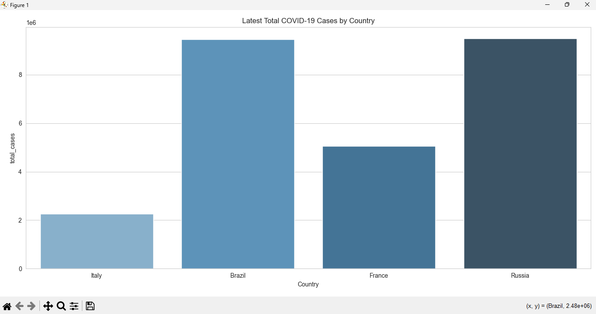
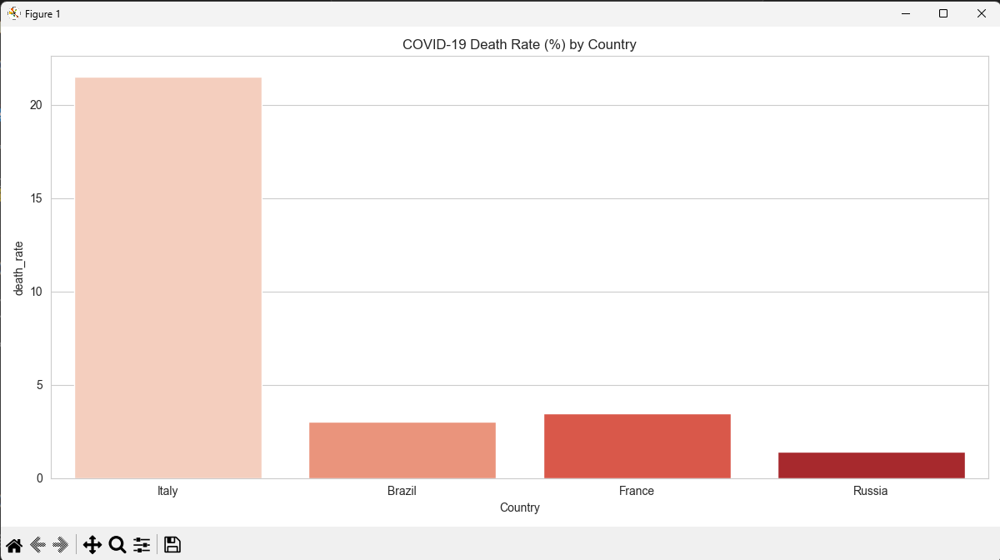
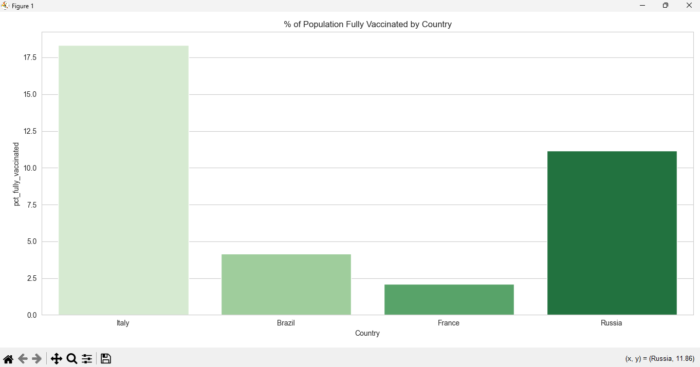

# COVID-19 Global Data Tracker

```
Affected Countries Dashboard  
```


```
Death Rate Dashboard  
```



```
Population Vaccination Dashboard  
```


A Python data analysis project tracking global COVID-19 trends including cases, deaths, and vaccination progress across countries.

## Objectives
- Import and clean COVID-19 global data
- Analyze time trends (cases, deaths, vaccinations)
- Compare metrics across countries/regions
- Visualize trends with charts
- Generate insights about pandemic progression

## Tools & Libraries
- Python
- Pandas (Data manipulation)
- Matplotlib (Visualization)
- Seaborn (Enhanced visualizations)
- Jupyter Notebook (Optional environment)

## How to Run
1. Clone repository:
```bash
git clone https://github.com/JAS-D98/power-learn-project/tree/main/python-week-8-assignment-Final_Project  
```
2.Run following command on your terminal:
```python
python app.py
``` 